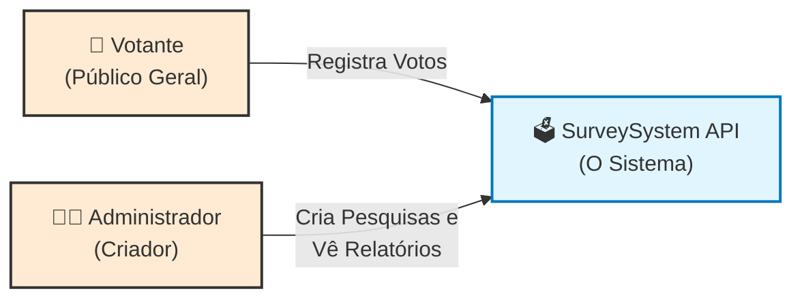

# Survey - Arquitetura de Software Escalável para Pesquisa Online


## 1. Visão Geral e Objetivo

Este projeto consiste em uma aplicação de uma API RESTful desenvolvida em **.NET 9**, projetada para gerenciar enquetes públicas de alta demanda (cenário de "milhões de votos").

O objetivo acadêmico principal é demonstrar a aplicação prática dos princípios de **Domain-Driven Design (DDD)** e **Clean Architecture**, focando no desacoplamento entre regras de negócio, persistência de dados e interface de usuário. O sistema simula um backend para uma startup de pesquisas eleitorais, priorizando a integridade do domínio e a preparação para escalabilidade horizontal.

---

## 2. Tecnologias e Ferramentas

* **Plataforma:** .NET 9 (C# 12)
* **Framework Web:** ASP.NET Core Web API
* **ORM:** Entity Framework Core 9.0.0
* **Banco de Dados:** In-Memory Database
* **Documentação:** Swagger UI (OpenAPI)
* **IDE Recomendada:** Visual Studio Community ou VS Code

---

## 3. Arquitetura do Sistema

O projeto segue estritamente a arquitetura em camadas concêntricas (**Onion Architecture / Clean Architecture**), garantindo que o núcleo (Domínio) não dependa de detalhes externos.

### 3.1 Estrutura de Pastas e Responsabilidades

A solução é dividida nas seguintes camadas lógicas:

* **📂 Domain (Núcleo)**
    * Contém as Regras de Negócio Puras.
    * `Entities`: *Survey, Question, Vote* (Objetos com identidade e comportamento).
    * `Interfaces`: *ISurveyRepository, IVoteRepository* (Contratos de inversão de dependência).
    * *Nota:* Esta camada não possui referências a banco de dados ou frameworks HTTP.

* **📂 Application (Orquestração)**
    * Implementa os Casos de Uso.
    * `Services`: *SurveyService*. Coordena a lógica entre repositórios e entidades.
    * `DTOs`: Objetos de transferência de dados para evitar expor as entidades diretamente (Foco em Segurança e Performance).

* **📂 Infrastructure (Detalhes)**
    * Implementação técnica e acesso a dados.
    * `Persistence`: *ApplicationDbContext* (Configuração do EF Core).
    * `Repositories`: Implementação concreta das interfaces definidas no Domínio.

* **📂 API (Entrada)**
    * Camada de apresentação REST.
    * `Controllers`: Recebem requisições HTTP e devolvem Status Codes padronizados (200, 201, 404).

---

## 4. Decisões de Design (Design Decisions)

### 4.1 Domain-Driven Design (DDD)
* **Aggregate Root:** A entidade `Survey` atua como raiz de agregação. Perguntas (`Question`) e Opções (`Option`) só podem ser manipuladas através da `Survey`, garantindo consistência (ex: uma pergunta não pode existir órfã).
* **Encapsulamento:** As listas de perguntas são expostas como `IReadOnlyCollection`, impedindo que camadas externas manipulem a coleção diretamente sem passar pelas validações do método `AddQuestion`.

### 4.2 Estratégia de Escalabilidade (Performance)
Para atender ao requisito de "milhões de votos", a entidade `Vote` foi modelada de forma desacoplada da `Survey`.

* ❌ **Cenário Ingênuo:** Salvar o voto dentro da lista de votos da Pesquisa (`Survey.Votes.Add()`). Isso carregaria a pesquisa inteira na memória para cada voto, travando o banco e consumindo memória excessiva.
* ✅ **Cenário Implementado:** O `Vote` é uma entidade leve e independente. A gravação é uma operação de **INSERT pura (O(1))**. A leitura (Relatório) é feita via Projeção no Banco de Dados (`GroupBy`/`Select`), sem carregar os dados brutos para a memória da aplicação.

### 4.3 DTOs (Data Transfer Objects)
O uso de **Records** para DTOs garante imutabilidade e simplifica a transferência de dados. Isso desacopla o contrato da API (o que o frontend vê) do modelo do banco de dados (o que o backend armazena).

---

## 5. Como Executar o Projeto

### Pré-requisitos
* SDK do .NET 9.0 instalado.
* Visual Studio ou VS Code.

### Passo a Passo
1.  Clone o repositório ou baixe os arquivos.
2.  Abra a solução `SurveySystem.sln` no Visual Studio.
3.  Restaure os pacotes NuGet (o VS fará isso automaticamente ou via `dotnet restore`).
4.  Defina o projeto **API** como "StartUp Project".
5.  Execute a aplicação (F5 ou botão Play).
6.  Abra o navegador no endereço `http://localhost:<porta>/swagger`

--- 

## 6. Documentação da API (Endpoints)

| Método   | Endpoint                   | Descrição                                               | Status Sucesso |
| :------- | :------------------------- | :------------------------------------------------------ | :------------- |
| **POST** | `/api/Surveys`             | Cria uma nova pesquisa com perguntas e opções.          | `201 Created`  |
| **GET**  | `/api/Surveys/{id}/report` | Obtém os dados da pesquisa e contagem parcial de votos. | `200 OK`       |
| **POST** | `/api/Surveys/{id}/vote`   | Registra um voto em uma opção específica.               | `200 OK`       |

### Exemplo de JSON para Criação (POST /api/Surveys)

```json
{
  "title": "Eleições Presidenciais",
  "description": "Pesquisa de intenção de voto 2026",
  "questions": [
    {
      "text": "Em quem você votaria?",
      "options": ["Candidato A", "Candidato B", "Nulo"]
    }
  ]
}
```

## 7. Diagramas

### Diagrama de Contexto (Nível 1)

Este diagrama é a visão de mais alto nível do sistema, conhecida como "Visão de Caixa Preta". Ele define as fronteiras do sistema (o que é o software e o que é externo a ele) e os atores envolvidos.

<b>Atores (Usuários):</b>

- Votante (Público Geral): Representa os milhões de usuários que acessam o sistema exclusivamente para enviar dados (input). Sua interação é unidirecional e focada em escrita (POST /vote).

- Administrador (Criador): O stakeholder que configura o sistema. Ele fornece os dados iniciais (criação da enquete) e consome a informação processada (relatórios).

<b>O Sistema (SurveySystem API):</b>

- Neste nível, não importa se o sistema é feito em .NET, Java ou Python. Ele é representado como uma entidade única responsável por centralizar a lógica de votação.




### Diagrama de Fluxo e Arquitetura (Nível Detalhado)

Este diagrama combina a visão do Modelo C4 (Nível Container/Componente) com um Fluxograma de Dados. Ele mostra a "Visão de Caixa Branca", detalhando como uma requisição atravessa as camadas da Clean Architecture e do DDD.

Detalhamento do Fluxo (Da esquerda para a direita):

<b>1. Camada de Apresentação (API Layer - Azul):</b>

- SurveysController: É a porta de entrada. Sua única função é receber o protocolo HTTP (JSON), validar se os dados básicos estão corretos e repassar para quem entende do assunto (Service).

- Swagger: Representa a interface de documentação e teste manual.

<b>2. Camada de Aplicação (Application Layer - Amarelo):</b>

- SurveyService: É o "maestro" ou orquestrador. Ele não sabe salvar no banco, nem sabe validar regras de negócio puras (como "uma pergunta precisa de 2 opções"). Ele apenas coordena: pega o pedido do Controller, converte DTOs em Entidades e chama o Repositório.

- DTOs (Data Transfer Objects): São caixas de transporte. Eles garantem que a estrutura do banco de dados (Entidades) nunca seja exposta diretamente para o mundo externo (API), garantindo segurança e desacoplamento.

<b>3. Camada de Domínio (Domain Layer - Verde):</b>

- Entidades (Entities): Onde vive a regra de negócio. O objeto Survey sabe que não pode existir sem perguntas. O objeto Vote é criado aqui. Esta camada é "pura", ou seja, não depende de bibliotecas externas ou bancos de dados.

- Interfaces: Definem os "contratos". O Domínio diz: "Eu preciso que alguém salve este Voto, não me importa como". Isso é a aplicação do princípio de Inversão de Dependência (DIP) do SOLID.

<b>4. Camada de Infraestrutura (Infrastructure Layer - Roxo):</b>

- Repositórios: São as implementações técnicas dos contratos do Domínio. O VoteRepository diz: "Eu sei como salvar aquele voto que o Domínio pediu: vou usar o EF Core".

- ApplicationDbContext: É a ferramenta (ORM) que traduz os objetos C# para comandos de banco de dados.

<b>5. Persistência (Database - Cinza):</b>

- In-Memory DB: O local físico (neste caso, na memória RAM) onde os dados repousam.

```mermaid
flowchart LR
    %% ======= Estilização =======
    classDef actor fill:#ffebd3,stroke:#333,stroke-width:2px;
    classDef api fill:#e1f5fe,stroke:#0277bd,stroke-width:2px;
    classDef app fill:#fff9c4,stroke:#fbc02d,stroke-width:2px;
    classDef domain fill:#e8f5e9,stroke:#2e7d32,stroke-width:2px;
    classDef infra fill:#f3e5f5,stroke:#7b1fa2,stroke-width:2px;
    classDef db fill:#eceff1,stroke:#455a64,stroke-width:2px;

    %% ======= Atores Externos =======
    UserPublic["👤 Votante - Público"]:::actor
    UserAdmin["🧑‍💼 Administrador - Criador"]:::actor

    %% ======= Sistema =======
    subgraph System["🗳️ SurveySystem - ASP.NET Core 9"]
        direction LR

        %% --- Camada de API ---
        subgraph ApiLayer["🌐 API Layer - Entrada"]
            Controller["🎮 SurveysController"]:::api
            Swagger["📄 Swagger UI"]:::api
        end

        %% --- Camada de Aplicação ---
        subgraph AppLayer["🧠 Application Layer - Orquestração"]
            Service["⚙️ SurveyService"]:::app
            DTOs["📦 DTOs - VoteRequest, SurveyReportDto"]:::app
        end

        %% --- Camada de Domínio ---
        subgraph DomainLayer["📚 Domain Layer - Regras Puras"]
            Entities["🧱 Entidades - Survey, Question, Vote"]:::domain
            Interfaces["🔌 Interfaces - ISurveyRepository..."]:::domain
        end

        %% --- Camada de Infraestrutura ---
        subgraph InfraLayer["🗄️ Infrastructure Layer - Persistência"]
            Repos["🛠️ Repositórios Concretos"]:::infra
            DbContext["🗃️ ApplicationDbContext - EF Core"]:::infra
        end

        %% --- Banco de Dados ---
        Database[("💾 In-Memory DB")]:::db
    end

    %% ======= Fluxos e Conexões =======
    
    %% 1. Interação do Usuário
    UserPublic -->|POST /vote| Controller
    UserAdmin -->|POST /surveys| Controller
    Swagger -.->|Documenta| Controller

    %% 2. Controller -> Service
    Controller -->|1. Recebe JSON e converte| DTOs
    Controller -->|2. Chama método Async| Service

    %% 3. Service -> Domain
    Service -->|3. Cria e Valida| Entities
    Service -->|4. Chama Contrato| Interfaces

    %% 4. Domain -> Infra (CORREÇÃO AQUI)
    %% Seta pontilhada (Flowchart) em vez de herança (Class Diagram)
    Interfaces -.->|Implementado por| Repos
    
    Repos -->|5. Usa| DbContext
    
    %% 5. Infra -> Banco
    DbContext -->|6. Salva e Consulta| Database

    %% Nota de Retorno
    Database -.->|Retorna Dados| Repos
    Repos -.->|Retorna Entidade ou DTO| Service
    Service -.->|Retorna DTO| Controller
    Controller -.->|Retorna HTTP 200 ou 404| UserPublic
```


